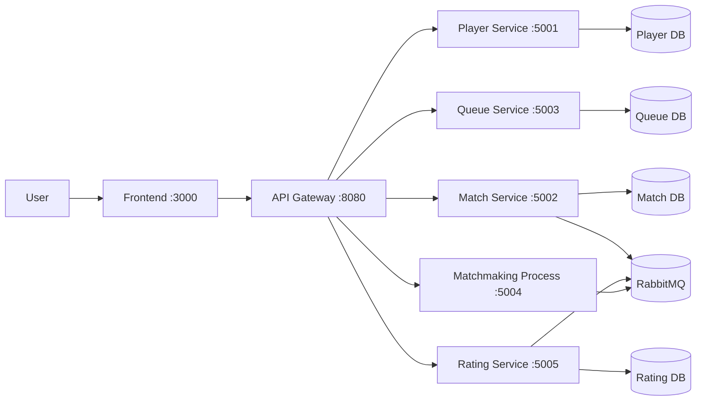

# Glicko2 Matchmaking System

[](https://github.com/hungdn1701/microservices-assignment-starter/stargazers)
[](https://github.com/hungdn1701/microservices-assignment-starter/network/members)
[](LICENSE)

> Brief description of the business process being automated and the service-oriented solution.

<!-- > **New to this repo?** See [`GETTING_STARTED.md`](GETTING_STARTED.md) for setup instructions, workflow guide, and submission checklist. -->

---

## Team Members

| Name | Student ID | Role | Contribution |
|------|------------|------|-------------|
|Dương Phan Bảo Linh|B22DCCN485|All|All|

---

## Business Process

Player queues up for a match, the matchmaking system begins searching for suitable opponents. It uses the player's skill rating as the primary criterion, looking for other players with similar ratings. When a suitable group of players is found, the system creates a match. It then assigns each player to a team, trying to balance the overall skill level of both teams. After the match, recalculate rating base on the match result.

---

## Architecture



| Component | Responsibility | Tech Stack | Port |
|-----------|-----------------|------------|------|
| **Frontend** | User interface, queue & match status display | Vue.js | 3000 |
| **API Gateway** | Request routing, SSE relay, CORS handling | Traefik | 8080 |
| **Player Service** | Player profiles and lookup | ASP.NET Core (.NET 9) | 5001 |
| **Queue Service** | Queue tickets and opponent search | ASP.NET Core (.NET 9) | 5003 |
| **Match Service** | Match creation and result persistence | ASP.NET Core (.NET 9) | 5002 |
| **Matchmaking Process** | Match orchestration and saga coordination | ASP.NET Core (.NET 9) | 5004 |
| **Rating Service** | Player rating persistence and calculation | ASP.NET Core (.NET 9) | 5005 |
| **Message Broker** | Event-driven saga coordination | RabbitMQ 3 | 5672 |

---

## Quick Start

```bash
docker compose up --build
```

Verify: `curl http://localhost:8080/health`

> For full setup instructions, prerequisites, and development commands, see [`GETTING_STARTED.md`](GETTING_STARTED.md).

---

## Documentation

| Document | Description |
|----------|-------------|
| [`GETTING_STARTED.md`](GETTING_STARTED.md) | Setup, workflow, submission checklist |
| [`docs/analysis-and-design.md`](docs/analysis-and-design.md) | Analysis & Design — Step-by-Step Action approach |
| [`docs/analysis-and-design-ddd.md`](docs/analysis-and-design-ddd.md) | Analysis & Design — Domain-Driven Design approach |
| [`docs/architecture.md`](docs/architecture.md) | Architecture patterns, components & deployment |
| [`docs/api-specs/`](docs/api-specs/) | OpenAPI 3.0 specifications for each service |

---

## License

This project uses the [MIT License](LICENSE).

> Template by [Hung Dang](https://github.com/hungdn1701) · [Template guide](GETTING_STARTED.md)

