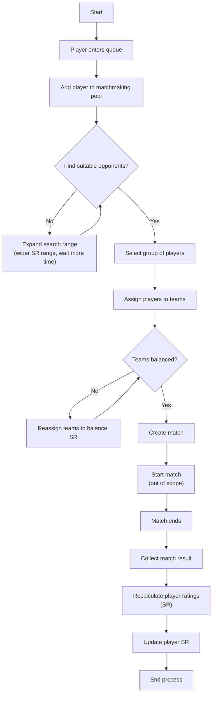
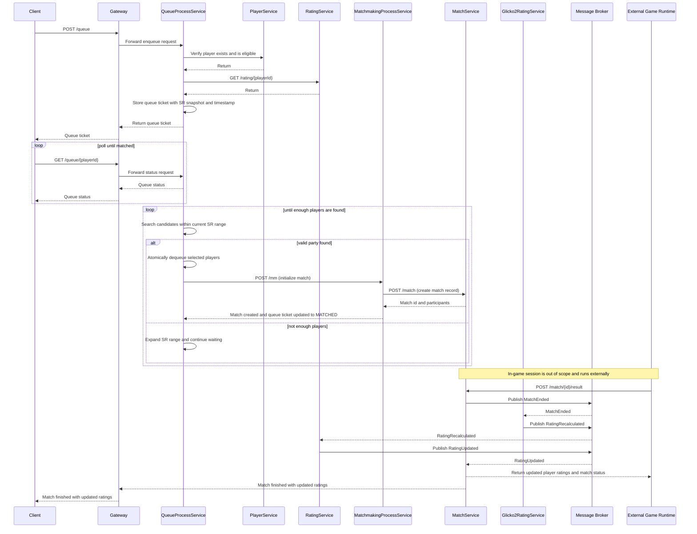
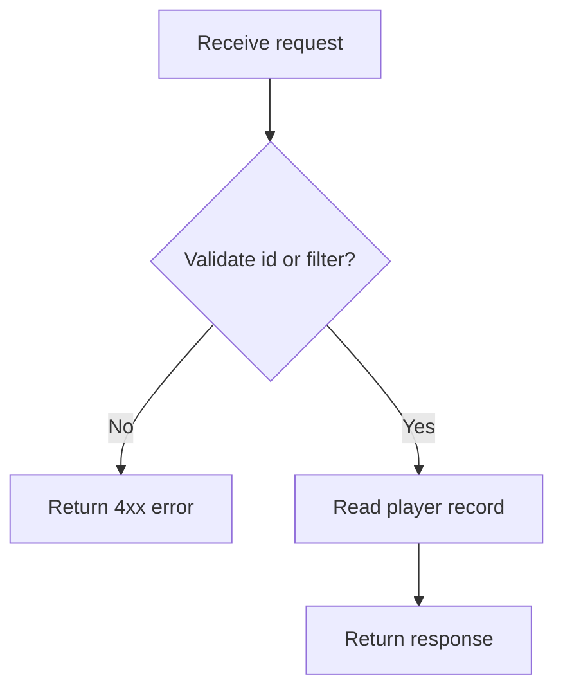
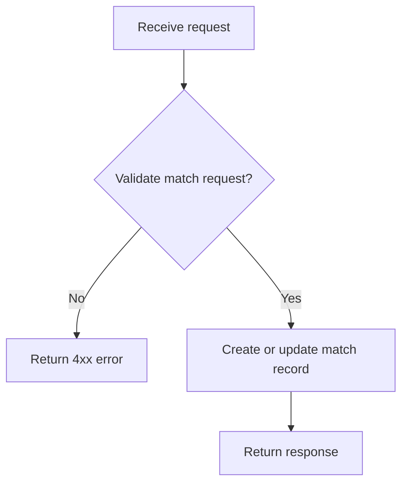
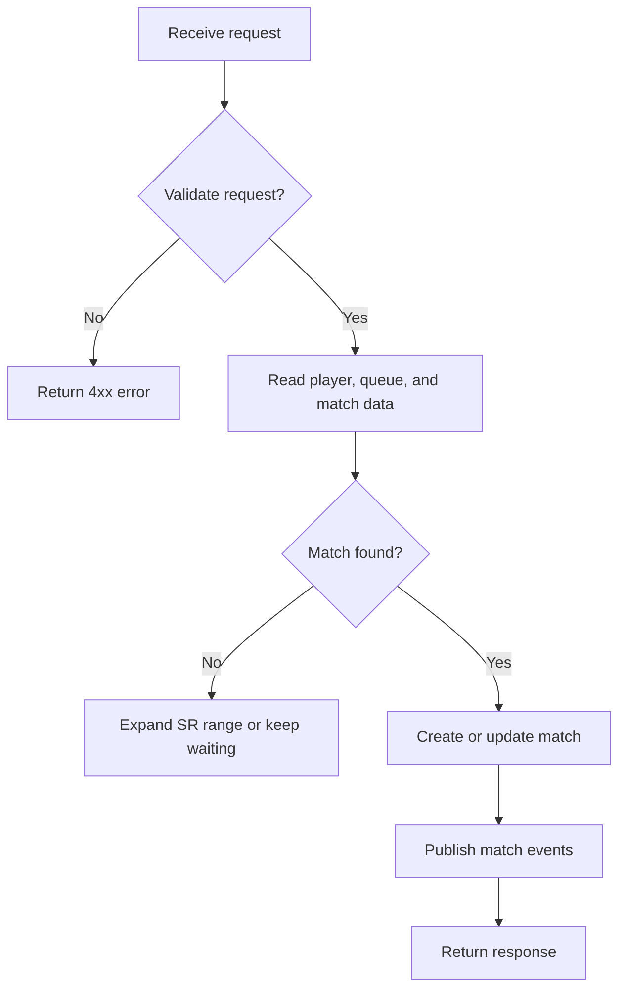
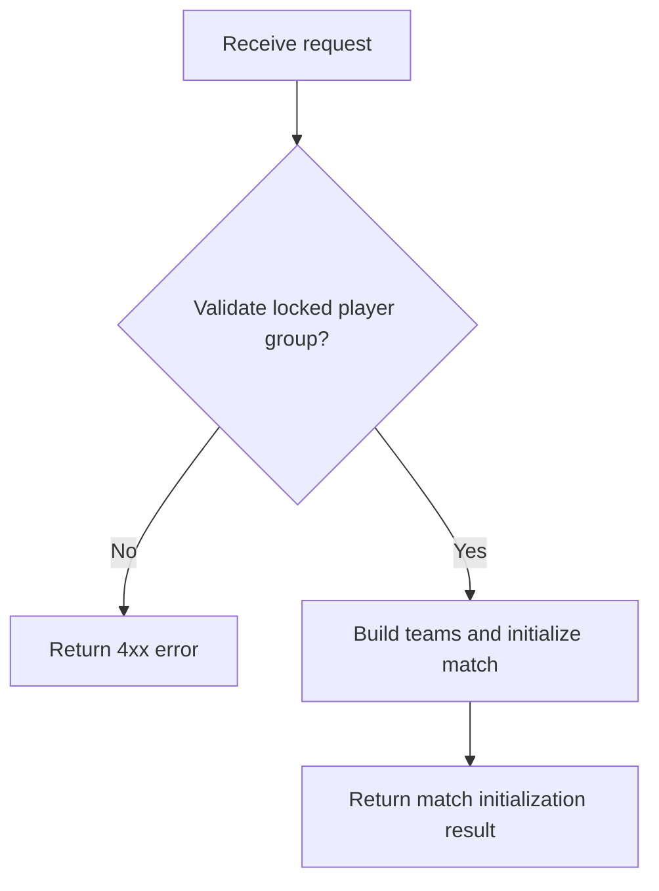
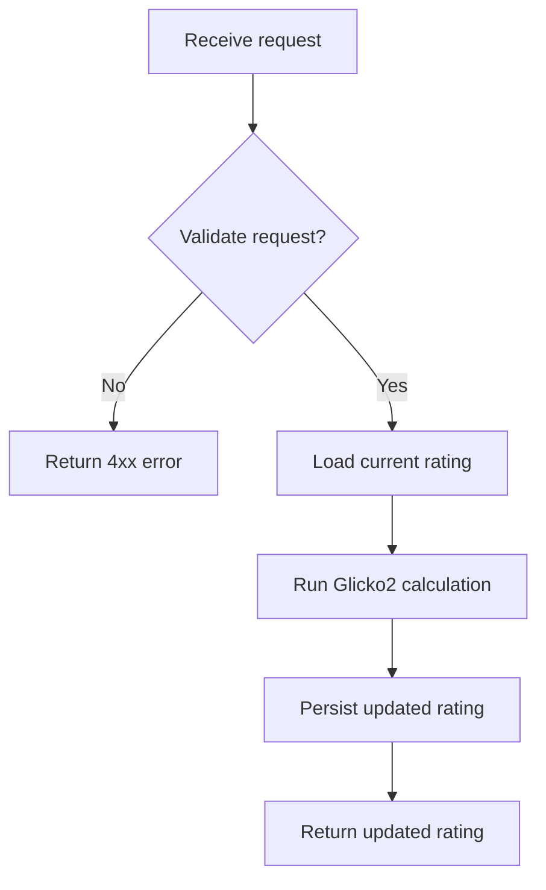
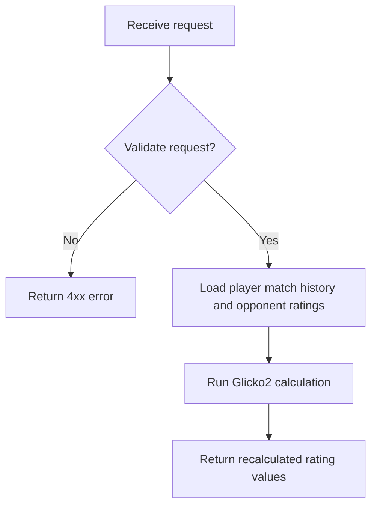

# Analysis and Design — Business Process Automation Solution

> **Goal**: Analyze a specific business process and design a service-oriented automation solution (SOA/Microservices).
> Scope: 4–6 week assignment — focus on **one business process**, not an entire system.

**References:**
1. *Service-Oriented Architecture: Analysis and Design for Services and Microservices* — Thomas Erl (2nd Edition)
2. *Microservices Patterns: With Examples in Java* — Chris Richardson
3. *Bài tập — Phát triển phần mềm hướng dịch vụ* — Hung Dang (available in Vietnamese)

---

## Part 1 — Analysis Preparation

### 1.1 Business Process Definition

Describe or diagram the high-level Business Process to be automated.

- **Domain**: Matchmaking & Rating System
- **Business Process**: Once a player queues up for a match, the matchmaking system begins searching for suitable opponents. It uses the player's skill rating as the primary criterion, looking for other players with similar ratings. When a suitable group of players is found, the system creates a match. It then assigns each player to a team, trying to balance the overall skill level of both teams. After the match, recalculate rating base on the match result.
- **Actors**: Player
- **Scope**: From the moment a player enters the queue to to all players' SR updated. Excludes in-game play.

**Process Diagram:**

### 1.2 Existing Automation Systems

List existing systems, databases, or legacy logic related to this process.

| System Name | Type | Current Role | Interaction Method |
|-------------|------|--------------|-------------------|
| Valve's MMR System |External Rating Service / Matchmaking Backend|Calculates player skill rating (MMR), supports matchmaking decisions, updates ratings after matches|API calls (internal service endpoints), event-driven updates after match results|
|Riot's MMR System| External Rating & Matchmaking Service | Determines hidden MMR, supports matchmaking, adjusts rating based on performance and match outcome| API calls|

> If none exist, state: *"None — the process is currently performed manually."*

### 1.3 Non-Functional Requirements

Non-functional requirements serve as input for identifying Utility Service and Microservice Candidates in step 2.7.

| Requirement    | Description |
|----------------|-------------|
| Performance    |             |
| Security       |             |
| Scalability    |             |
| Availability   |             |

---

## Part 2 — REST/Microservices Modeling

### 2.1 Decompose Business Process & 2.2 Filter Unsuitable Actions

Decompose the process from 1.1 into granular actions. Mark actions unsuitable for service encapsulation.

| # | Action | Actor | Description | Suitable? |
|---|--------|-------|-------------|-----------|
|1|Player queues for match|Player|Player sends request to join matchmaking queue|✅|
|2|Add player to matchmaking pool|Game Server|Store player as waiting with current SR and queue timestamp|✅|
|3|Find opponents in SR range|Game Server|Search waiting players with similar SR|✅|
|4|Expand search range over time|Game Server|Increase acceptable SR gap as wait time grows|✅|
|5|Initalize a match|Game Server|Lock a valid group of players for one match|✅|
|6|Create match record|Game Server|Generate match id and participant list|✅|
|7|Assign teams to balance SR|Game Server|Split players into teams with minimal SR difference|✅|
|8|Start in-game match session|Game Server|Launch actual gameplay session (out of assignment scope)|❌|
|9|Receive final match result|Game Server|Get winner/loser and per-player outcomes from game server|✅|
|10|Recalculate player ratings|Game Server|Apply rating algorithm (Glicko-2) after match result|✅|
|11|Update persisted player SR|Game Server|Save new ratings to rating datastore|✅|

> Actions marked ❌: manual-only, require human judgment, or cannot be encapsulated as a service.

### 2.3 Entity Service Candidates

Identify business entities and group reusable (agnostic) actions into Entity Service Candidates.

| Entity | Service Candidate | Agnostic Actions |
|--------|-------------------|------------------|
|Player|PlayerService|Get player profiles, get player by id, get player by status|
|Match|MatchService|Create match record, get match by id, update match status and result|
|Rating|RatingService|Get player rating, update player rating|

### 2.4 Task Service Candidate

Group process-specific (non-agnostic) actions into a Task Service Candidate.

| Non-agnostic Action | Task Service Candidate |
|---------------------|------------------------|
|Enqueue player, find opponents in SR range, and dequeue matched players|QueueProcessService|
|Initialize a match from a locked player group|MatchmakingProcessService|

<!-- > **Queueing design note:** `QueueProcessService` owns the waiting-list lifecycle. It stores a queue ticket with `playerId`, current `SR`, join timestamp, and queue status. A matcher job or internal request expands the acceptable SR range over time, selects a valid group atomically, and then removes those players from the queue before handing the candidate set to `MatchmakingProcessService`. -->

### 2.5 Identify Resources

Map entities/processes to REST URI Resources.

| Entity / Process | Resource URI |
|------------------|--------------|
|Player|/player|
|Match|/match|
|Rating|/rating|
|MatchmakingProcess|/mm|
|QueueProcess|/queue|

### 2.6 Associate Capabilities with Resources and Methods

| Service Candidate | Capability | Resource | HTTP Method |
|-------------------|------------|----------|-------------|
|PlayerService|Get player profiles|/player|GET|
|PlayerService|Get player by id|/player/{id}|GET|
|MatchService|Create match record|/match|POST|
|MatchService|Get match by id|/match/{id}|GET|
|MatchService|Update match status and result|/match/{id}/result|POST|
|RatingService|Get player rating|/rating/{id}|GET|
|RatingService|Update player rating|/rating/{id}|POST|
|QueueProcessService|Enqueue player to pool|/queue|POST|
|QueueProcessService|Get queue status by player id|/queue/{playerId}|GET|
|QueueProcessService|Find opponents in SR range|/queue/search|POST|
|QueueProcessService|Dequeue player from pool|/queue/{playerId}|DELETE|
|MatchmakingProcessService|Initialize a match|/mm|POST|
|Glicko2RatingService|Calculate player rating using Glicko2 model|/glicko2|POST|

### 2.7 Utility Service & Microservice Candidates

Based on Non-Functional Requirements (1.3) and Processing Requirements, identify cross-cutting utility logic or logic requiring high autonomy/performance.

| Candidate | Type (Utility / Microservice) | Justification |
|-----------|-------------------------------|---------------|
|QueueProcessService|Microservice|Manages a high-churn waiting queue, requires atomic candidate selection, and benefits from independent scaling and low-latency access|
|Glicko2RatingService|Microservice|Calculate player rating using Glicko2 model|

<!-- 
> **Saga note:** the same business flow can be implemented as a choreography Saga without changing the order of steps. Each service still handles the same matchmaking and rating sequence, but the handoffs are represented as domain events instead of a single central workflow controller. -->

### 2.8 Service Composition Candidates

Interaction diagram showing how Service Candidates collaborate to fulfill the business process.

---

## Part 3 — Service-Oriented Design

> Part 3 is the **convergence point** — regardless of whether you used Step-by-Step Action or DDD in Part 2, the outputs here are the same: service contracts and service logic.

### 3.1 Uniform Contract Design

Service Contract specification for each service. Full OpenAPI specs:
- [`docs/api-specs/player-service.yaml`](api-specs/player-service.yaml)
- [`docs/api-specs/match-service.yaml`](api-specs/match-service.yaml)
- [`docs/api-specs/queue-process-service.yaml`](api-specs/queue-process-service.yaml)
- [`docs/api-specs/matchmaking-process-service.yaml`](api-specs/matchmaking-process-service.yaml)
- [`docs/api-specs/rating-service.yaml`](api-specs/rating-service.yaml)
- [`docs/api-specs/glicko2-rating-service.yaml`](api-specs/glicko2-rating-service.yaml)

> 💡 **Derive from Part 2:** Each service capability from 2.6 maps to one API endpoint. Update the OpenAPI spec files to match.

**PlayerService:**

| Endpoint | Method | Description | Request Body | Response Codes |
|----------|--------|-------------|--------------|----------------|
|/health|GET|Health check|None|200|
|/player|GET|Get player profiles|None|200|
|/player/{id}|GET|Get player by id|None|200, 404|

**MatchService:**

| Endpoint | Method | Description | Request Body | Response Codes |
|----------|--------|-------------|--------------|----------------|
|/health|GET|Health check|None|200|
|/match|POST|Create match record|Match create request|201, 400|
|/match/{id}|GET|Get match by id|None|200, 404|
|/match/{id}/result|POST|Update match status and result|Match result callback|200, 400|

**QueueProcessService:**

| Endpoint | Method | Description | Request Body | Response Codes |
|----------|--------|-------------|--------------|----------------|
|/health|GET|Health check|None|200|
|/queue|POST|Enqueue player to pool|Queue request|201, 400|
|/queue/{playerId}|GET|Get queue status by player id|None|200, 404|
|/queue/search|POST|Find opponents in SR range|Queue search request|200|
|/queue/{playerId}|DELETE|Dequeue player from pool|None|204, 404|

**MatchmakingProcessService:**

| Endpoint | Method | Description | Request Body | Response Codes |
|----------|--------|-------------|--------------|----------------|
|/health|GET|Health check|None|200|
|/mm|POST|Initialize a match from locked players|Match init request|201, 400|

**RatingService:**

| Endpoint | Method | Description | Request Body | Response Codes |
|----------|--------|-------------|--------------|----------------|
|/health|GET|Health check|None|200|
|/rating/{id}|GET|Get player rating|None|200, 404|
|/rating/{id}|POST|Update player rating|Rating update request|200, 404|

**Glicko2RatingService:**

| Endpoint | Method | Description | Request Body | Response Codes |
|----------|--------|-------------|--------------|----------------|
|/health|GET|Health check|None|200|
|/glicko2|POST|Calculate player rating using Glicko2 model|Rating calculation request|200, 400|

### 3.2 Service Logic Design

Internal processing flow for each service.

**PlayerService:**

**MatchService:**

**QueueProcessService:**

**MatchmakingProcessService:**

**RatingService:**

**Glicko2RatingService:**

