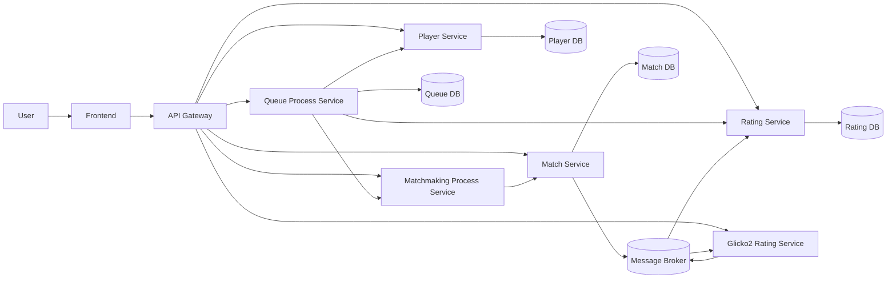

# System Architecture

> This document is completed **after** the Analysis and Design phase.
> Choose **one** analysis approach and complete it first:
> - [Analysis and Design — Step-by-Step Action](analysis-and-design.md)
> - [Analysis and Design — DDD](analysis-and-design-ddd.md)
>
> Both approaches produce the same inputs for this document: **Service Candidates**, **Service Composition**, and **Non-Functional Requirements**.

**References:**
1. *Service-Oriented Architecture: Analysis and Design for Services and Microservices* — Thomas Erl (2nd Edition)
2. *Microservices Patterns: With Examples in Java* — Chris Richardson
3. *Bài tập — Phát triển phần mềm hướng dịch vụ* — Hung Dang (available in Vietnamese)

---

### How this document connects to Analysis & Design

```
┌─────────────────────────────────────────────────────┐
│         Analysis & Design (choose one)              │
│                                                     │
│  Step-by-Step Action        DDD                     │
│  Part 1: Analysis Prep     Part 1: Domain Discovery │
│  Part 2: Decompose →       Part 2: Strategic DDD →  │
│    Service Candidates        Bounded Contexts       │
│  Part 3: Service Design    Part 3: Service Design   │
│    (contract + logic)        (contract + logic)     │
└────────────────┬────────────────────────────────────┘
                 │ inputs: service list, NFRs,
                 │         service contracts (API specs)
                 ▼
┌─────────────────────────────────────────────────────┐
│         Architecture (this document)                │
│                                                     │
│  1. Pattern Selection                               │
│  2. System Components (tech stack, ports)           │
│  3. Communication Matrix                            │
│  4. Architecture Diagram                            │
│  5. Deployment                                      │
└─────────────────────────────────────────────────────┘
```

> 💡 **What you need before starting:** your completed service list from Part 2 (service candidates and their responsibilities) and your service contracts from Part 3 (API endpoints). This document turns those logical designs into a concrete, deployable system architecture.

---

## 1. Pattern Selection

Select patterns based on business/technical justifications from your analysis.

| Pattern | Selected? | Business/Technical Justification |
|---------|-----------|----------------------------------|
| API Gateway | X | Frontend uses a single entry point for routing, CORS, and request isolation |
| Database per Service | X | Player, Match, Queue, and Rating services each own their own data and persistence lifecycle |
| Shared Database | | |
| Saga | X | Matchmaking, result handling, and rating updates form a long-running workflow across multiple services |
| Event-driven / Message Queue | X | Match end and rating update events are exchanged through a broker |
| CQRS | | |
| Circuit Breaker | | |
| Service Registry / Discovery | | |
| Other: | | |

> Reference: *Microservices Patterns* — Chris Richardson, chapters on decomposition, data management, and communication patterns.

---

## 2. System Components

| Component     | Responsibility | Tech Stack      | Port  |
|---------------|----------------|-----------------|-------|
| **Frontend**  | Player UI, queue polling, match/result display, Game Server simulation | Vue.js | 3000  |
| **Gateway**   | Single entry point, routing, CORS, request isolation | Traefik | 8080  |
| **Player Service** | Player profiles and player lookup | .NET 9 | 5001  |
| **Match Service** | Match record creation and result persistence | .NET 9 | 5002  |
| **Queue Process Service** | Queue ticket lifecycle and opponent search | .NET 9 | 5003  |
| **Matchmaking Process Service** | Match initialization and team setup | .NET 9 | 5004  |
| **Rating Service** | Persist and expose player rating data | .NET 9 | 5005  |
| **Glicko2 Rating Service** | Rating calculation using Glicko-2 | .NET 9 | 5006  |
| **Message Broker** | Publish/subscribe event transport for saga steps | .NET 9 | 5672  |
| **Player DB**  | Player persistence | Mysql | 5432  |
| **Match DB**   | Match persistence | Mysql | 5433  |
| **Queue DB**   | Queue persistence | Mysql | 5434  |
| **Rating DB**  | Rating persistence | Mysql | 5435  |

---

## 3. Communication

### Inter-service Communication Matrix

| From \\ To | Frontend | Gateway | Player Service | Match Service | Queue Process Service | Matchmaking Process Service | Rating Service | Glicko2 Rating Service | Message Broker | Player DB | Match DB | Queue DB | Rating DB |
|------------|----------|---------|----------------|---------------|----------------------|-----------------------------|---------------|------------------------|---------------|-----------|----------|----------|----------|
| Frontend | - | REST | - | - | - | - | - | - | - | - | - | - | - |
| Gateway | - | - | REST | REST | REST | REST | REST | REST | - | - | - | - | - |
| Player Service | - | - | - | - | - | - | - | - | - | Read | - | - | - |
| Match Service | - | - | - | - | - | - | - | - | Event publish / consume | - | Read / Write | - | - |
| Queue Process Service | - | - | REST | - | - | REST | REST | - | - | - | - | Read / Write | - |
| Matchmaking Process Service | - | - | - | REST | - | - | - | - | - | - | - | - | - |
| Rating Service | - | - | - | - | - | - | - | - | Event publish / consume | - | - | - | Read / Write |
| Glicko2 Rating Service | - | - | - | - | - | - | - | - | Event publish / consume | - | - | - | - |
| Message Broker | - | - | - | Event consume | - | - | Event consume | Event consume | - | - | - | - | - |
| Player DB | - | - | Write | - | - | - | - | - | - | - | - | - | - |
| Match DB | - | - | - | Write | - | - | - | - | - | - | - | - | - |
| Queue DB | - | - | - | - | Write | - | - | - | - | - | - | - | - |
| Rating DB | - | - | - | - | - | - | Write | - | - | - | - | - | - |

---

## 4. Architecture Diagram

> Place diagrams in `docs/asset/` and reference here.



---

## 5. Deployment

- All services containerized with Docker
- Orchestrated via Docker Compose
- Includes the API Gateway, six backend services, message broker, and per-service databases
- Single command: `docker compose up --build`
